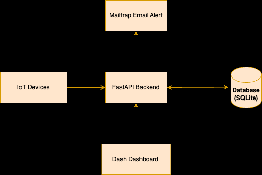
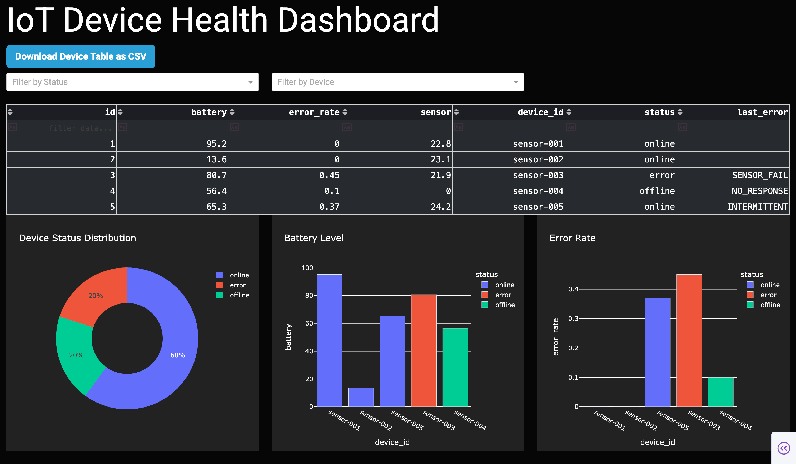
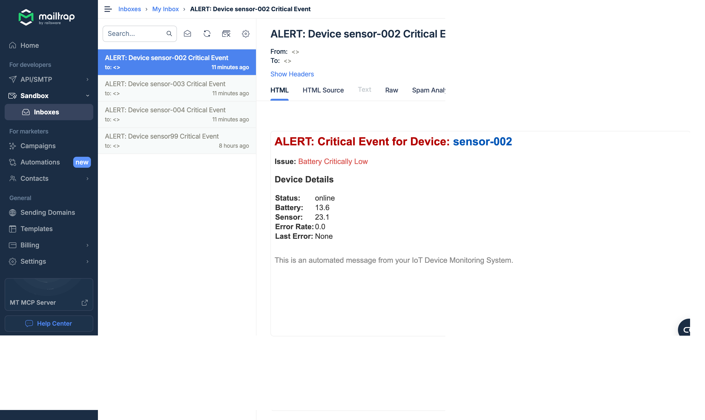

# IoT Device Health Dashboard

*A beginner-friendly project for monitoring IoT devices with real-time visualization and automated alerting*

**Author:** Alishba Jawaid

---

## Introduction

Hello! My name is Alishba, and the goal of this project is to make it simple (and, to be honest, enjoyable) to monitor your IoT devices—whether they are in a classroom, warehouse, or just your own tech experiments. With this dashboard, you’ll always know which devices are in good condition and which require maintenance. No more surprises!

---

## Table of Contents

1. [Project Overview](#project-overview)
2. [Problem Statement](#problem-statement)
3. [Solution Overview](#solution-overview)
4. [Technologies Used](#technologies-used)
5. [High-Level Architecture](#high-level-architecture)
6. [Architecture Diagram](#architecture-diagram)
7. [Component Deep Dive](#component-deep-dive)
8. [Key Features & User Flow](#key-features--user-flow)
9. [Setup & Usage Instructions](#setup--usage-instructions)
10. [Sample Screenshots](#sample-screenshots)
11. [Future Improvements](#future-improvements)

---

## Project Overview

The IoT Device Health Dashboard is a comprehensive monitoring solution for IoT or edge devices (like sensors or embedded controllers) in a data center, lab, or warehouse. It enables you to:

- Collect sensor, battery, and status data from devices via a REST API.
- Visualize device health and metrics in real-time through an interactive web dashboard.
- Receive instant email notifications when a device has a problem (error, offline, or low battery).
- Export device data as CSV for analysis or reports.

This project is perfect for learning about databases, real-time dashboards, backend API design, and integrating alerting/notification logic in Python.

---

## Problem Statement

Manual monitoring is no longer practical as the number of IoT devices in factories, offices, and warehouses rises. Problems like:

- Unexpected device shutdowns
- Sensors indicating malfunctions
- Low batteries that aren’t promptly replaced

...can result in significant issues, such as data loss and downtime.

**A solution is needed that provides:**
- Real-time device monitoring
- Instant alerting for critical issues
- Easy visualization and access to device data

---

## Solution Overview

This project delivers a complete solution:

- **Backend API:** A FastAPI server receives updates from devices (status, battery, etc.).
- **Database:** SQLModel and SQLite are used to store device data.
- **Dashboard:** A web dashboard (Dash/Plotly) lets users view status charts, visualize real-time device data, and export CSV files.
- **Email Alerts:** The system automatically sends an email alert (using Mailtrap for safe development) when a device reports an error, goes offline, or its battery runs low.

---

## Technologies Used

| Layer            | Technology                                 |
|------------------|--------------------------------------------|
| Database         | SQLModel, SQLite                           |
| Visualization    | Dash, Plotly, Dash Bootstrap Components    |
| Email Alerts     | smtplib (Python built-in), Mailtrap        |
| Config           | python-dotenv                              |
| Data Fetching    | requests, pandas                           |

---

## High-Level Architecture

- Devices use HTTP POST requests to the FastAPI backend to send status updates on a regular basis.
- After receiving the data, the FastAPI backend stores it in a local SQLite database and looks for critical events.
- If a critical event is detected, the backend uses SMTP to send an email alert (Mailtrap for testing and development).
- Device data is retrieved from the backend by the Dashboard (Dash/Plotly), which also shows tables and charts and lets users download the data in CSV format for additional analysis.

---

## Architecture Diagram



## Component Deep Dive

### 1. Backend API (FastAPI)
- `/devices (POST)`: Devices send their status. The backend updates or creates device records and checks for errors/offline/low battery.
- `/devices (GET)`: Get a list of all device statuses.
- `/devices/{device_id} (GET)`: Get info on a single device.

**Example device update request:**
```json
{
  "device_id": "sensor-001",
  "status": "online",
  "battery": 74.2,
  "sensor": 23.5,
  "error_rate": 0.02,
  "last_error": null
}
```
### 2. Database (SQLModel/SQLite)
- Keeps all device data in a table.
- Quick, file-based, ideal for beginners, and simple to expand to larger databases.

| id | device_id  | status | battery | sensor | error_rate | last_error  |
|----|------------|--------|---------|--------|------------|-------------|
| 1  | sensor-001 | online | 74.2    | 23.5   | 0.02       | null        |
| 2  | sensor-002 | error  | 18.9    | 21.7   | 0.3        | SENSOR_ERR  |

---

### 3. Dashboard (Dash/Plotly)
- **Live device table:** View the status of every device.
- **Charts:** Shows error rates, battery levels, and device status distribution.
- **Filtering:** By status or device.
- **Export:** Get device data in CSV format.
- **Dark theme and warning banners** for malfunctioning or disconnected devices.

---

### 4. Email Notification (Mailtrap/SMTP)
- If any device reports `status: "error"`, `"offline"`, or `battery < 20`, an alert email is sent.
- Uses Mailtrap SMTP for development so you never spam your real email.

---

## Key Features & User Flow

1. Device sends update  
2. API saves data & checks for alerts  
3. Dashboard fetches and displays data  
4. If needed, system sends alert email  
5. User sees alert and dashboard updates instantly

---

## Setup & Usage Instructions

**1. Clone the repo and install dependencies:**
```bash
git clone https://github.com/yourusername/iot-device-dashboard.git
cd iot-device-dashboard
python3 -m venv .venv
source .venv/bin/activate
pip install -r requirements.txt
```
**2. Set up your `.env` file**

**Copy your Mailtrap SMTP credentials:**
```bash
EMAIL_USER=your_mailtrap_username
EMAIL_PASSWORD=your_mailtrap_password
EMAIL_HOST=sandbox.smtp.mailtrap.io
EMAIL_PORT=587
```
**3. Start the backend (FastAPI):**
```bash
uvicorn main:app --reload
```
**4. Start the dashboard:**
```bash
python dashboard.py
```
The dashboard will be live at http://localhost:8050.

**5. Simulate device updates**

Use Swagger UI (http://localhost:8000/docs) or a script to POST device status.

**Example payload for /devices (POST):**

```json
{
  "device_id": "sensor-005",
  "status": "error",
  "battery": 15.0,
  "sensor": 30.5,
  "error_rate": 0.5,
  "last_error": "OVERHEAT"
}
```
Check your Mailtrap inbox for alerts!
## Sample Screenshots

**Dashboard main view:**  



**Live alert banner:**  


**Mailtrap email example:**  


---

## Future Improvements

- Store historical device metrics and show trends over time
- User authentication and access control
- Move from Mailtrap to a real-world email provider (SendGrid, Amazon SES)
- Map view for devices with geolocation
- Device detail and logs
- Add Slack/Discord/Telegram notifications
- Deploy on Docker, AWS, or Azure

---
